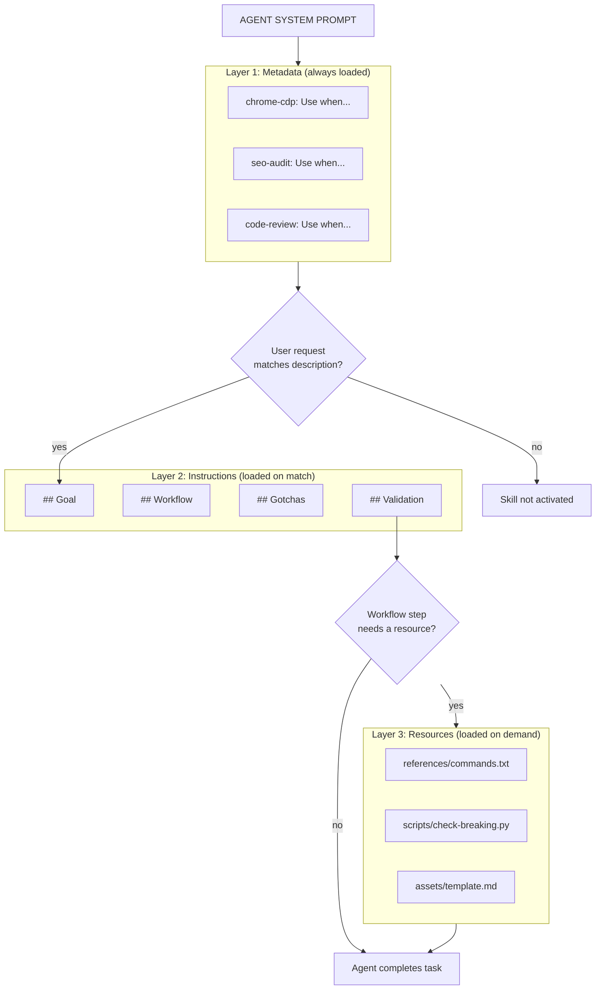

*This guide comes from building agent workflows, watching them fail in boring ways, and learning that most of the quality comes from the shape of the instructions, not the volume of them.*

> [!SUMMARY]
> A great `SKILL.md` is not a long prompt. It is a small, discoverable operating manual for one repeatable class of work.
>
> - The `description` decides whether the skill loads.
> - The body should teach a reusable procedure, not dump background knowledge.
> - Scripts, references, and assets should be loaded only when they earn their place.
> - The skill is not finished until you have tested it against real prompts.

## Start With the Real Job

`SKILL.md` is deceptively simple.

At minimum, an agent skill is a folder with a `SKILL.md` file inside it. The official [Agent Skills overview](https://agentskills.io/home) describes the format as a lightweight way to package specialized knowledge, workflows, scripts, references, templates, and other resources for agents.

That sounds like documentation.

It is not.

A good `SKILL.md` is closer to a tiny operating system for a repeated task. It tells the agent when the skill applies, what procedure to follow, what files to consult, what scripts to run, what traps to avoid, and how to know whether the result is good.

The wrong way to write a skill is to ask an LLM:

> "Write me a skill for code review."

You will get generic advice. Check for security issues. Follow best practices. Handle errors appropriately. Write clean code.

That kind of skill is almost useless because the model already knows those words. What it does not know is your review rubric, your repository conventions, your API quirks, your failure history, your allowed tools, your deployment rules, and the small exceptions that keep causing mistakes.

Think of it like handing someone a cheat sheet before a task. If they have done it before, they do not need one. But if it is something they were never taught, that cheat sheet is the difference between guessing and getting it right.

Every `SKILL.md` starts with the same design question: does the model already know how to do this, or do I need to teach it? Trust the weights where training is strong. Provide instructions where it falls short. The entire point of a skill is to close that gap.

So the first rule is simple:

> [!QUOTE]
> Do not write a skill from vibes. Extract it from real work.

Start from a task you have actually done with an agent:

- Where did you have to correct it?
- Which commands did it forget to run?
- Which file did it keep reading too late?
- Which edge case did it miss?
- Which output format did you have to restate?
- Which decision did it make differently from how your team works?

Those corrections are the raw material for a strong `SKILL.md`.

Later in this post, I will walk through a real `chrome-cdp` skill where keeping `SKILL.md` as Markdown but moving dense command documentation out into flat text references cut the baseline skill cost from roughly 1,500 tokens to about 80. That example is the practical version of the whole argument: the best skill is not the one with the most context, but the one that loads the right context at the right time.

## Before You Write a Skill, Check If You Need One

Not every task needs a skill. Some tasks are already well-handled by the model out of the box.

Before you invest in writing a `SKILL.md`, run the task without one. Give the agent the same prompt, the same files, and see what happens. If the result is already good, you do not need a skill. You need to leave it alone.

A skill is worth writing when:

- The model gets the task mostly right but keeps missing the same edge case.
- The task requires project-specific knowledge the model could not have seen in training.
- The workflow has a strict sequence and the agent keeps doing steps out of order.
- The output needs a specific format and the agent keeps improvising a different one.
- The task involves running scripts or consulting reference material the agent cannot infer.

A skill is not worth writing when:

- The model already handles the task well and your skill would just restate what it does naturally.
- The task is a one-off that you will not repeat.
- The "skill" is really just general advice like "write clean code" or "be thorough."

If you write a skill for something the model already does well, you are not helping. You are adding context tax: extra tokens the agent has to process that do not change the outcome. Worse, a mediocre skill can override good default behavior with rigid instructions that fit fewer situations.

The bar is simple: does this skill make the agent measurably better at this task than it was without the skill? If the answer is no, delete it.

## Understand How Skills Load

In most skill runtimes, skills work because of progressive disclosure.

The agent does not load every skill at startup. It works in layers, and each layer costs tokens. The [specification](https://agentskills.io/specification) formalizes this as progressive disclosure:



In this model, the registry is cheap and usually present as metadata. The body is loaded only when relevant. The resources are expensive and loaded only when a specific workflow step calls for them.

That loading model changes how you should write.

Your `description` is not SEO copy. It is the routing layer. If it is too vague, the skill will not trigger. If it is too broad, the skill will trigger when it should not and pollute the agent's context with irrelevant instructions.

Your body is not a knowledge base. Once activated, the whole body enters the context window. Every extra paragraph competes with the user's task, the codebase, tool outputs, conversation history, and other active instructions.

Your references are not a dumping ground. They are deferred context. The main skill should tell the agent exactly when to read each one.

This is why a good skill feels compact but complete. It gives the agent the next useful context at the moment it needs it.

## How Agents Know Which Skill to Use

This is the part that makes `SKILL.md` feel a little magical from the outside.

In most runtimes, the agent does not discover skills by wandering the filesystem and reading every `SKILL.md` it can find. That would be expensive and noisy. Instead, the agent starts with a skills registry.

Think of the registry as an index injected into the agent's instruction context before the user request is handled. It contains just enough information for routing:

```text
Available skills

- chrome-cdp: Use when inspecting or controlling a running Chromium browser through the Chrome DevTools Protocol.
  file: /Users/black/.codex/skills/chrome-cdp/SKILL.md

- seo-audit: Use when auditing, reviewing, or diagnosing SEO issues on a website.
  file: /Users/black/.agents/skills/seo-audit/SKILL.md

- design-taste-frontend: Use when designing, polishing, or critiquing frontend interfaces.
  file: /Users/black/.agents/skills/design-taste-frontend/SKILL.md
```

That registry is not the full skill. It is metadata: name, description, and path. The detailed behavior still lives in the referenced `SKILL.md`.

The flow looks like this:

1. The session starts.
2. The agent receives a registry of available skills in its instruction context.
3. The user asks for something.
4. The agent compares the request against the skill descriptions.
5. If a description matches, or the user explicitly names a skill, the agent opens that skill's `SKILL.md`.
6. The agent follows the workflow inside the file.
7. If the skill points to scripts, references, or assets, the agent loads those only when needed.

This is why the `description` field matters so much. It is the part the agent sees before activation. If your description fails to describe the user's intent, the skill may never load, even if the body is excellent.

For example, imagine a skill named `public-api-review`.

Weak registry entry:

```text
- public-api-review: Helps with APIs.
  file: /skills/public-api-review/SKILL.md
```

Strong registry entry:

```text
- public-api-review: Use when reviewing public API endpoint changes, OpenAPI schema edits, SDK generation impact, API versioning, deprecations, backward compatibility, or rollout risk for external clients.
  file: /skills/public-api-review/SKILL.md
```

The second entry gives the agent more ways to recognize the right moment. It can match direct asks like "review this public API change" and indirect asks like "will this SDK response change break customers?"

That is the real job of the registry: it lets the agent choose the right skill without loading every skill.

## The Folder Structure That Scales

The basic structure is:

```text
my-skill/
|-- SKILL.md
|-- scripts/
|-- references/
|-- assets/
`-- evals/
```

Only `SKILL.md` is required. Everything else should justify itself.

Use `scripts/` for repeatable logic the agent should not reinvent every run. Use `references/` for longer technical docs that are only sometimes needed. Use `assets/` for templates, example files, schemas, or reusable outputs. Use `evals/` for prompts and expected outputs that test whether the skill is working.

My bias: start with one file. Add folders only after the skill has failed in a way that a folder would fix.

If the agent keeps writing the same 40-line parser badly, add a script. If it keeps forgetting an API edge case that only matters on authentication failures, add `references/auth-errors.md` and tell it when to read it. If it keeps formatting reports inconsistently, add a template in `assets/`.

Do not create structure because it looks mature. Create structure because it removes ambiguity.

## The Frontmatter Matters More Than People Think

A `SKILL.md` starts with YAML frontmatter. The required fields are `name` and `description`.

```markdown
---
name: api-migration-review
description: Use this skill when reviewing API migration changes, versioned endpoint updates, backward-compatibility risks, request/response schema changes, or rollout plans for public APIs.
---
```

The `name` should be boring and precise. Lowercase, hyphenated, and aligned with the folder name. The spec requires the `name` to match the parent directory, stay under 64 characters, and avoid invalid hyphen patterns.

The `description` is where most skills win or lose.

The official [description optimization guide](https://agentskills.io/skill-creation/optimizing-descriptions) makes the key point: the description carries the burden of triggering. The agent sees it before it sees the rest of your skill.

Write it like an instruction to the agent:

```markdown
description: Use this skill when the user asks to review, migrate, version, deprecate, or validate public API endpoints, even if they describe the work as a release check, backward-compatibility review, SDK impact check, or schema cleanup.
```

That is better than:

```markdown
description: Helps with APIs.
```

The good version names user intent, near-miss phrasing, and adjacent contexts. It gives the agent more hooks without becoming a paragraph of mush.

My rule of thumb:

- Include the obvious task names.
- Include the words users actually type.
- Include indirect descriptions of the same intent.
- Include the boundary if false triggers are likely.
- Keep it short enough that you would not resent loading it across many skills.

If a skill is not triggering, the body is not the first thing I edit. The description is.

## Write the Body Like a Workflow, Not a Wiki

After the frontmatter, the body should answer four questions:

1. When this skill is active, what should the agent do first?
2. What sequence should it follow?
3. What should it never miss?
4. How should it validate the result?

A reliable structure looks like this:

```markdown
## Goal

Help the user review public API migration changes for compatibility, rollout risk,
and documentation completeness.

## Workflow

1. Identify the changed endpoints, schemas, SDK types, and docs.
2. Compare old and new request/response contracts.
3. Check compatibility risks before style or naming issues.
4. Verify rollout, monitoring, and rollback notes.
5. Return findings ordered by severity with file references.

## Gotchas

- Treat removed optional response fields as breaking if external clients may rely on them.
- Do not assume internal endpoint usage means the endpoint is private.
- Check generated SDK types when OpenAPI schemas change.

## Output

Use this structure:

- Blocking issues
- Compatibility risks
- Documentation gaps
- Suggested follow-up tests
```

Notice what is missing: generic API definitions, a history of REST, and a lecture on software quality.

The [best practices guide](https://agentskills.io/skill-creation/best-practices) gives the right mental model: add what the agent lacks, omit what it already knows. That is the fastest way to keep a skill high-signal.

The best body sections are usually:

- `Goal`
- `When to use`
- `Workflow`
- `Decision rules`
- `Gotchas`
- `Validation`
- `Output format`
- `Available scripts`
- `References`

You do not need all of them. Use the sections that match the fragility of the task.

For fuzzy work, explain principles and tradeoffs. For fragile work, be prescriptive. A design critique skill can leave room for judgment. A production database migration skill should be much stricter.

## Gotchas Are the Highest-Value Section

The fastest way to improve a skill is to maintain a `Gotchas` section.

This is where you put the facts that the agent would reasonably get wrong.

Bad gotcha:

```markdown
- Be careful with errors.
```

Useful gotcha:

```markdown
- The `/health` endpoint only checks that the web server is running. Use `/ready`
  when validating database and queue connectivity.
```

Bad gotcha:

```markdown
- Follow our naming conventions.
```

Useful gotcha:

```markdown
- Public API fields use `snake_case`; internal TypeScript types use `camelCase`.
  Do not rename public response fields to match internal types.
```

Gotchas work because they are dense with corrective context. They encode the scar tissue from previous failures.

Personal experience: every time I correct an agent twice for the same reason, that correction belongs in a skill. Not as a philosophical rule. As a concrete gotcha with the exact condition and the expected behavior.

## Give Defaults, Not Menus

Agents get worse when you hand them five equally plausible options and say "choose the best one."

That is often how humans write documentation:

```markdown
You can use Jest, Vitest, Playwright, Cypress, or a manual test depending on the situation.
```

The agent now has to spend reasoning budget deciding which branch to take. Worse, it may pick a tool your project does not use.

Give a default:

```markdown
Use Vitest for unit and integration tests. Use Playwright only for browser flows.
If the change touches authentication redirects, add at least one Playwright test.
```

This is one of the most useful patterns from real agent work. A skill should reduce choices where your team already has a preference.

Menus are for humans. Defaults are for agents.

## Use Templates When Output Shape Matters

If the output must follow a specific format, show the format.

Agents pattern-match concrete examples better than prose instructions. Instead of saying "write a concise review with severity and evidence," give the shape:

```markdown
## Output format

Return findings in this format:

### Blocking

- `file/path.ts:123` - Issue summary.
  Evidence: What proves this is a problem.
  Fix: Specific change recommended.

### Non-blocking

- `file/path.ts:456` - Issue summary.
  Evidence: Why it matters.
  Fix: Specific change recommended.

### No issues found

If there are no findings, say that clearly and mention what you checked.
```

For long templates, store them in `assets/` and reference them:

```markdown
Use `assets/review-output-template.md` when writing the final review.
```

Do this only when the template is large enough to justify being separate. Small templates belong inline because the agent should see them immediately.

## Scripts Make Skills Real

Scripts are where a skill stops being just instruction and starts becoming reliable machinery.

The official [using scripts guide](https://agentskills.io/skill-creation/using-scripts) recommends referencing scripts with relative paths and designing them for non-interactive agent execution. That matches what works in practice.

Good scripts for skills have a few properties:

- They accept inputs through flags, files, environment variables, or stdin.
- They do not block on interactive prompts.
- They print helpful errors.
- They support `--help`.
- They use structured output like JSON, CSV, or TSV when possible.
- They are idempotent or have a safe dry-run mode for risky operations.

A script that says this is bad:

```text
Error: invalid input
```

A script that says this is useful:

```text
Error: --format must be one of: json, csv, table.
Received: xml
Usage: python scripts/process.py --format json input.csv
```

The agent can recover from the second error. The first one usually wastes a turn.

In `SKILL.md`, list scripts explicitly:

````markdown
## Available scripts

- `scripts/check-openapi-breaking-changes.py` - Compares two OpenAPI files and reports breaking changes as JSON.
- `scripts/find-sdk-impact.ts` - Finds generated SDK files affected by schema changes.

## Workflow

1. Run the OpenAPI comparison:

   ```bash
   python3 scripts/check-openapi-breaking-changes.py --before old.json --after new.json
   ```

2. If schemas changed, run the SDK impact check:

   ```bash
   deno run --allow-read scripts/find-sdk-impact.ts --schema new.json
   ```
````

Prefer a script when the operation is mechanical, repeated, easy to validate, or easy for the model to mess up. Prefer instructions when judgment matters.

## References Should Be Loaded on Purpose

The main `SKILL.md` should stay compact. The spec recommends keeping it under control and moving detailed material into referenced files when needed.

The mistake is writing:

```markdown
See `references/` for more information.
```

That does not tell the agent when to spend context.

Write:

```markdown
Read `references/auth-error-codes.md` if the API returns a 401, 403, or provider-specific auth error.
Read `references/release-checklist.md` before finalizing a production rollout plan.
Read `references/schema-rules.md` when editing OpenAPI schemas or generated SDK types.
```

The trigger matters.

Good references are narrow. One file per decision area usually beats a giant reference doc. If the reference file needs a table of contents, it may be too broad for a skill.

## A Complete `SKILL.md` Template

Below is a full template you can use as a starting point. If you have already internalized the structure from the sections above, feel free to skim this and jump to the testing sections that follow.

```markdown
---
name: public-api-review
description: Use this skill when reviewing public API endpoint changes, OpenAPI schema edits, SDK generation impact, API versioning, deprecations, backward compatibility, or rollout risk for external clients.
license: Proprietary
compatibility: Requires git, Python 3.11+, and access to repository files.
---

## Goal

Review public API changes for backward compatibility, client impact, rollout risk,
and documentation completeness.

## Workflow

1. Identify changed endpoints, schemas, generated SDK files, docs, and tests.
2. Compare the old and new request/response contracts.
3. Check breaking-change risk before style or naming feedback.
4. Verify docs, changelog, migration notes, monitoring, and rollback plan.
5. Return findings ordered by severity with file references and concrete fixes.

## Decision Rules

- Treat removed response fields as breaking unless the field was never public.
- Treat new required request fields as breaking.
- Treat enum value removal or renaming as breaking.
- Treat response type narrowing as risky even if tests pass.
- Do not suggest public field renames for internal consistency alone.

## Gotchas

- Public API fields use `snake_case`; internal TypeScript types use `camelCase`.
- The `/health` endpoint is not a readiness check. Use `/ready` for rollout validation.
- SDK generation happens from OpenAPI files, not from controller types.

## Available Scripts

- `scripts/check-openapi-breaking-changes.py` - Reports schema-level breaking changes as JSON.
- `scripts/find-sdk-impact.ts` - Finds generated SDK files affected by schema changes.

## References

- Read `references/schema-rules.md` when OpenAPI files change.
- Read `references/release-checklist.md` before approving a production rollout.

## Validation

Before finalizing:

1. Confirm every changed public endpoint has test coverage.
2. Confirm SDK impact was checked when schemas changed.
3. Confirm docs or migration notes exist for user-visible changes.
4. If no issues are found, state what was checked.

## Output Format

### Blocking

- `file:line` - Issue summary.
  Evidence: What proves this is a problem.
  Fix: Specific recommendation.

### Risk

- `file:line` - Issue summary.
  Evidence: Why this may affect clients.
  Fix: Specific recommendation.

### Checked

- Brief list of areas reviewed.
```

Do not copy this blindly. Replace the content with your own domain facts. The structure is the reusable part.

## Test the Trigger Before You Trust the Skill

A skill that never activates is just a file in a folder.

Create a small set of trigger tests:

```json
[
  {
    "query": "Can you review this OpenAPI diff before we ship the new billing endpoint?",
    "should_trigger": true
  },
  {
    "query": "Can you rename this internal React hook?",
    "should_trigger": false
  },
  {
    "query": "My SDK users may break after this response shape change. Can you check?",
    "should_trigger": true
  },
  {
    "query": "Can you write a basic Express route for a toy app?",
    "should_trigger": false
  }
]
```

The official guide suggests using realistic positive and negative prompts, including near-misses. That is important. Do not test only the easy cases where the user says the exact skill name.

Real users are messy. They mention file paths. They use casual phrasing. They describe symptoms instead of domains. They bury the relevant ask inside a larger request.

Your trigger evals should reflect that.

My practical starting point:

- 5 obvious should-trigger prompts
- 5 indirect should-trigger prompts
- 5 near-miss should-not-trigger prompts
- 5 unrelated should-not-trigger prompts

If the skill false-triggers, narrow the description. If it misses relevant prompts, broaden it around intent rather than stuffing in exact keywords.

## Test Whether the Skill Improves Output

Triggering is only the first test. The harder question is whether the skill actually improves the result.

The [evaluating skills guide](https://agentskills.io/skill-creation/evaluating-skills) recommends running tasks with and without the skill so you have a baseline. That is the right instinct.

For each eval, define:

- the user prompt
- input files, if any
- what good output should contain
- objective assertions where possible

Example:

```json
{
  "skill_name": "public-api-review",
  "evals": [
    {
      "id": "required-request-field",
      "prompt": "Review this PR that adds a required field to the create customer API.",
      "expected_output": "Flags the new required request field as a breaking change and recommends a backward-compatible rollout.",
      "assertions": [
        "Identifies the required request field as breaking",
        "Mentions external client impact",
        "Suggests a compatible migration path",
        "References the changed schema or endpoint"
      ]
    }
  ]
}
```

Run it once without the skill and once with the skill. If the skill adds 1,500 tokens and does not improve the output, cut it or rewrite it.

This is the uncomfortable part: some skills should be deleted.

If the model already handles the task well, and your skill only adds ceremony, it is not a skill. It is context tax.

## The Iteration Loop

The first version of a skill is usually not the final version.

Use this loop:

1. Run real tasks.
2. Read the execution trace, not just the final answer.
3. Identify wasted steps, missed context, false triggers, and repeated corrections.
4. Edit the skill.
5. Re-run the same evals.
6. Keep the change only if behavior improves.

Look for patterns:

- If the agent starts too broadly, add a first step.
- If it misses a recurring edge case, add a gotcha.
- If it keeps choosing the wrong tool, give a default.
- If it produces inconsistent output, add a template.
- If it writes brittle logic repeatedly, add a script.
- If the skill triggers too often, tighten the description.
- If the skill never triggers, describe user intent more directly.

The skill gets better as it absorbs corrections from reality.

## Case Study: Optimizing the `chrome-cdp` Skill

This is a real example from my own work. It illustrates what the iteration loop looks like in practice. You can see the [final optimized skill on GitHub](https://github.com/madanlalit/agentskills/tree/main/chrome-cdp).

I built a `chrome-cdp` skill that lets agents interact with a running Chrome browser through the DevTools Protocol. The first working version was a 144-line Markdown file. It had a frontmatter description, a prerequisites section, detailed command documentation with separate headers for each command group, inline code blocks, workflow examples, and technical notes.

It worked. The agent could use it. But it was burning roughly 1,500 tokens every time the skill loaded, and most of those tokens were Markdown syntax: triple backticks, `###` headers, blank lines between code blocks, and repeated `python3 scripts/cdp.py` prefixes.

Here is how I iterated it down.

### Pass 1: Merge redundant sections

The `description` frontmatter and the opening `# Chrome CDP` paragraph were saying the same thing in slightly different words. I merged them into one comprehensive `description` and deleted the Markdown intro entirely. That saved a header, a paragraph, and the duplication.

### Pass 2: Remove what the model already knows

The `## Prerequisites` section listed "Python 3.9+" and "Chromium-based browser with remote debugging." But this was already in the frontmatter `compatibility` field. The agent does not need the same fact in two places. I moved the useful part (the `chrome://inspect/#remote-debugging` URL) into the `compatibility` metadata and deleted the section.

### Pass 3: Move commands out of `SKILL.md`

This was the big one. The commands section was 120+ lines of Markdown with headers, code blocks, and explanatory paragraphs. All of it was structured for human reading, with triple backticks and blank lines that the model does not need.

`SKILL.md` itself still has to be Markdown. The optimization was not changing the format of the skill file. It was moving dense, rarely edited command material out of the main `SKILL.md` and into `references/commands.txt` as a flat text file:

```text
COMMANDS (Usage: python3 scripts/cdp.py <cmd>)
<target>: Unique targetId prefix from `list`.

list - List open pages
shot <target> [file] [--full] - Screenshot viewport or full page
snap <target> [--full] - Accessibility tree snapshot
eval <target> <expr> - Evaluate JS
nav <target> <url> - Navigate and wait for page load
wait <target> <selector|--gone selector|--idle> [--timeout 15000] - Poll condition
click <target> <selector> - Click CSS selector
fill <target> <selector> <text> - Focus, clear, and type
press <target> <key> [modifier...] - Key events (Enter, Tab, ArrowDown)
...
```

Same information, but no Markdown overhead inside the command reference. For this kind of dense lookup material, the flat text format cut token usage by roughly 65-70% compared to the equivalent Markdown with headers and code blocks.

### Pass 4: Add a usage example as a separate reference

I added `references/usage.txt` with a concrete Hacker News scraping example, showing how to chain commands together. This stays out of the main skill but gives the agent a full working pattern to follow when it needs one.

### The result

The `SKILL.md` went from 144 lines to 17 lines:

```markdown
---
name: chrome-cdp
description: A Python CLI for interacting directly with the user's running
  Chromium browser via the Chrome DevTools Protocol (CDP). Connects via
  WebSocket to inspect pages, extract data, evaluate JS, and automate UI
  actions in open tabs. Requires explicit user approval; a background daemon
  ensures the "Allow debugging" prompt only requires one approval per tab.
metadata:
  author: madanlalit
  compatibility: Requires Python 3.9+ and chromium-based browser with
    remote debugging enabled.
---

## Usage

Before doing anything, read `references/commands.txt` to understand how to
execute the commands.
For comprehensive workflow examples, refer to `references/usage.txt`.
```

The token costs:

| Version | Tokens (approx) | Notes |
|---|---|---|
| v1: Full Markdown in SKILL.md | ~1,500 | Everything loaded on activation |
| v4: Slim SKILL.md + flat text refs | ~80 baseline + ~500 on demand | References loaded only when needed |

The baseline cost dropped from ~1,500 tokens to ~80 tokens. The agent still gets the full command reference when it needs it, but it only pays that cost when it actually activates the skill and reads the reference file. And even in the worst case, when the agent loads every reference, the total (~580 tokens) is still cheaper than the original single Markdown file was.

The key insight was not just "write less." `SKILL.md` remains Markdown, because that is the skill entrypoint. But for dense command references, Markdown syntax was a token tax. Headers, code fences, and blank lines looked clean to humans but cost tokens the model did not need for that job. Moving that reference material out of the main skill file and into flat text was dramatically cheaper, and the agent read it just as well.

That does not mean Markdown is bad. Markdown is still useful for the main `SKILL.md`, where headings and structure help both humans and agents maintain the workflow. The lesson is narrower: when a reference is mostly commands, flags, schemas, or compact lookup material, flat text can be the better format.

## Common Mistakes

Most skill problems fall into a short list. If you have read this far, some will sound familiar, but they are worth naming explicitly because they keep showing up.

| Mistake | Why it hurts | Fix |
|---|---|---|
| **Writing too much** | The agent searches through noise to find the signal. More tokens, worse focus. | Cut anything that does not change behavior. |
| **Explaining what the model already knows** | You burn context restating common knowledge (what JSON is, why tests matter). | Spend tokens only on project-specific facts and non-obvious constraints. |
| **One skill doing everything** | It triggers unpredictably and gives mixed instructions. | Split by workflow, not by org chart. One skill should feel like one function. |
| **No validation step** | Agents skip checks when you do not tell them what *done* means. | Add a checklist, a script, a self-review rubric, or a required command. |
| **No negative trigger tests** | The skill activates on broad words like "data," "review," or "API" when it should not. | Test with near-miss prompts that sound similar but belong to a different skill. |
| **Hiding critical facts in references** | The agent misses information it needs on every run. | If it matters every time, keep it in `SKILL.md`. References are for conditional detail. |

## My Personal Rules for Strong Skills

After using skills across coding, review, research, and workflow automation, these are the rules I keep coming back to:

1. One skill should feel like one function.
2. The description is a routing rule, not a summary.
3. The first step should be obvious.
4. Every gotcha should come from a real failure or a likely expensive mistake.
5. Give the agent defaults where your team has defaults.
6. Use scripts for deterministic work.
7. Use references for conditional depth.
8. Validate before final output.
9. Delete instructions that do not change behavior.
10. Re-run old evals after every meaningful edit.

The strongest skills are not the most comprehensive. They are the ones that make the agent behave differently in exactly the places where it used to fail.

## The Final Checklist

Before you call a `SKILL.md` done, check it against this list:

- The folder name and `name` match.
- The `description` says when to use the skill, not just what it is.
- The description includes indirect user intent and likely phrasing.
- The body starts with the actual workflow.
- Generic background has been removed.
- Gotchas are concrete and behavior-changing.
- Defaults are clear where multiple approaches exist.
- Output format is shown if consistency matters.
- References are conditional and named explicitly.
- Scripts are non-interactive, documented, and produce useful errors.
- The validation step is clear.
- Trigger tests include should-trigger and should-not-trigger prompts.
- Output evals compare behavior with and without the skill.

If you can pass that checklist, you probably have something useful.

## Write Less, Aim Better

`SKILL.md` works because it respects how agents actually operate.

They do not need a giant handbook. They need the right procedure at the right moment. They need concise routing metadata, sharp task instructions, concrete gotchas, reliable scripts, and a way to check their work.

The best skill files feel almost too small when you read them. Then you run them and realize the important decisions are all there.

That is the standard to aim for: not exhaustive, not clever, not decorative.

Just enough context to make the agent better at the task than it was without the skill. No more. No less.

## Related Reading

This post is the practical companion to [Why AGENTS.md Doesn't Work](/post/why-agents-md-doesnt-work). If you are deciding whether to build a platform around this, read [Why Most Orgs Don't Need Specialized Agentic Tools](/post/why-most-orgs-dont-need-specialized-agentic-tools).
