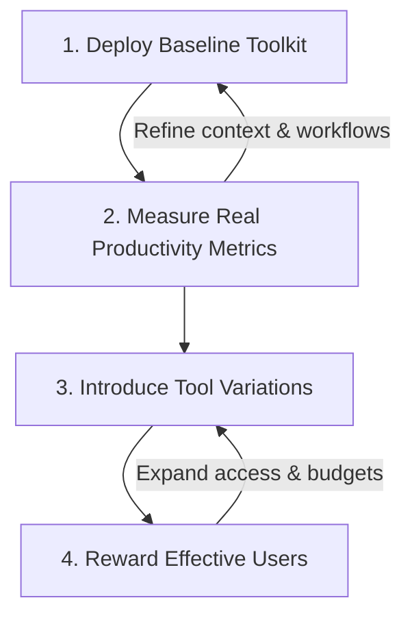

The invoice arrived on a Friday morning. 

It was for **$12,47,000**. 

For a 28 person team. 

Looking at the usage dashboard, it wasn't production traffic or database scaling. This was the cost of the developer team using different AI tools for any and every task they could think of with no huge productivity gains to show for it.

This is the new reality of the AI hype cycle: **The Invoice Shock**.

> [!SUMMARY]
> **TL;DR:** Throwing uncapped frontier model seats at developers is a recipe for runaway token costs and zero ROI. The winning strategy is a **Progressive Trust Model**: start with a baseline toolkit (one agentic IDE, one codebase indexer, local models), track cost per completed task (not prompt activity), and expand budgets to developers who prove they can convert tokens into shipped features.

Many enterprises are currently burning millions of dollars on AI token usage and licensing fees — not because the agents cannot do the work, but because the adoption strategy is launched **without a clear goal or structured roadmap**. They throw different agent seats at everyone (Cursor, Windsurf, Claude, Codex, etc.), hoping they "figure it out" via hit and trial. The agents deliver results, but at enormous cost: without structured context, they explore entire codebases, read irrelevant files, and burn through frontier model tokens on tasks that a properly configured agent would resolve in a fraction of the budget.

For smaller, agile organizations, this enterprise chaos is not a warning to stay away. It is a roadmap. By studying how large organizations waste resource budgets, smaller engineering teams can build a high-signal, targeted tooling roadmap that delivers a massive developer multiplier at a fraction of the cost.

---

## When Adoption Metrics Become a Cost Multiplier

The fastest way to inflate your AI bill is to reward the wrong behavior. When management tracks "AI adoption" by measuring prompts sent or tokens consumed, they incentivize quantity over precision. This creates a vicious cycle:

1. Teams deploy agents without structured context — no Model Context Protocol (MCP) servers, no workspace instructions, no curated schemas — and then wonder why the agent spends hundreds of thousands of tokens exploring the codebase on every task.
2. The output works, but it is expensive. The agent reads dozens of files it did not need, generates verbose solutions when a targeted one would suffice, and burns through frontier model capacity on tasks that a smaller, locally hosted model could handle.
3. The invoice rises exponentially while the actual time to ship features remains flat.

But the wrong metrics problem goes deeper than just counting prompts. Many of the features built into modern AI tools are themselves hidden token furnaces:

* **Autonomous long-horizon modes**: Features like `/goal` run the agent in a persistent loop — retrying, re-reading, and re-planning until it considers the task "complete." Without a verifiable output checkpoint, a single `/goal` invocation can burn through thousands of requests while the developer is away, producing work that may need to be entirely discarded.
* **"Faster" inference shortcuts**: Commands like `/fast` prioritize speed by using more aggressive model configurations. The output feels snappier, but the token cost per interaction can be significantly higher than the default mode. Developers who default to `/fast` for every interaction are paying a premium for speed they often do not need.
* **Unconstrained agent loops**: When an agent encounters a build error, it retries. When the retry fails, it tries a different approach. Without termination conditions, these correction loops can consume entire daily budgets on a single stuck task — and the developer never sees a usable result.

The fix is not to disable these features. It is to ensure developers understand the cost profile of each mode and use them deliberately. 

> [!TIP]
> **Use a Model Router:** A model router — like the one built into Devin Desktop — can automatically route requests to the appropriate model tier based on task complexity, keeping simple tasks cheap and reserving expensive inference for work that actually demands it.

---

## The Unlimited Credits Mistake

If wrong metrics are the accelerant, unlimited credits are the fuel.

Many organizations hand every developer an uncapped AI budget with no rate limits, no spending visibility, and no accountability. The logic sounds generous: *"We do not want to slow anyone down."* In practice, it removes every incentive to use the tool efficiently.

> [!WARNING]
> Unlimited LLM budgets remove the developer's incentive to scope tasks. When API calls are free, agents are instructed to "refactor the entire codebase" instead of "modify this specific file."

When a developer knows their usage is unlimited, there is no reason to scope a task tightly before delegating it. There is no reason to choose a local model over a frontier one. There is no reason to stop an agent loop that has been running for 20 minutes without output. Every wasteful pattern described in this post — vague instructions, unchecked loops, trivial tasks on expensive models — is amplified when there is no cost signal reaching the developer.

The alternative is not to starve developers of resources. It is to make cost visible and tie expanded access to demonstrated value:
* **Start with a reasonable baseline budget** per developer per month. Enough to be productive, not enough to be wasteful.
* **Make usage transparent**: Give developers a dashboard showing their token spend by model, by task category, and by tool mode. Most developers will self-correct once they see the numbers.
* **Expand access based on results**: Developers who consistently ship well — who use agents to close tickets faster, reduce review cycles, or automate repetitive tasks — earn higher budgets and access to additional tools. This is not punishment. It is investment directed at the people who have proven they know how to use it.

---

## The "Delegate Everything" Trap

The opposite failure mode is equally expensive. Instead of measuring adoption by activity, some teams go fully hands-off — delegating entire tasks to agents and walking away.

This sounds like the dream. In practice, it is a token furnace.

An agent without clear boundaries will attempt to solve whatever you give it, including tasks it has no business handling. A developer asks the agent to "refactor the auth module for better performance." The agent runs, reads 40 files, rewrites three services, introduces a caching layer nobody asked for, breaks two integration tests, and then enters a correction loop trying to fix what it just broke. Fifteen minutes and tens of thousands of tokens later, the developer reviews the diff and reverts most of it.

The problem is not that the agent failed. It is that the human never scoped the task. The agent is a tool — it does exactly what you point it at. Without human-in-the-loop checkpoints, developers will:
* **Delegate trivial tasks to expensive models**: A developer fires up a frontier agent to rename a variable or add a log statement. The agent reads 15 files for context, reasons about side effects, and delivers a one-line change that cost 10,000 tokens. The developer could have made the edit by hand in 30 seconds, or routed it through a local model at zero cost.
* **Walk away from stuck loops**: When an agent encounters an error, it retries. Without a termination condition or human review, a single stuck task can burn through an entire daily budget while the developer is at lunch. The human chose to step away without setting limits.
* **Give vague instructions and blame the output**: A developer tells the agent to "improve the auth module" without defining what "improve" means. The agent interprets the ambiguity, commits to a direction, and generates thousands of lines of code that solve a problem nobody asked for. The agent did not fail — the instruction did.

> [!IMPORTANT]
> **The 10x Agent Rule:** An agent that ships one well-scoped change in 500 tokens is infinitely more valuable than an agent that rewrites three files in 50,000 tokens. Define the task boundary before you hit enter. Set token limits. Review the agent's plan before it executes.

---

## The Starter Toolkit: Which Tools to Adopt First

Instead of throwing a complex array of AI tools at your team, start with a highly targeted, phased tool roadmap. Focus on existing tools that require minimal setup, present low security and financial risk, and offer the highest developer productivity gains.

### 1. Adopt Codebase Knowledge Indexers (Deepwiki or Google Codewiki)
Get your team access to **Deepwiki** (highly recommended) or Google Codewiki. Codebase comprehension is one of the single biggest bottlenecks in developer workflows. In large organizations, new developers can take months to become productive. A tool like Deepwiki significantly reduces onboarding time. It acts as an interactive indexer that exposes the nitty-gritty details and full context of the repository, helping developers get up to speed quickly on areas they are unfamiliar with.

### 2. Standardize on a Model-Agnostic Agentic IDE (Cursor, Windsurf, Zed, or VS Code)
Equip your developers with a model-neutral IDE like **Cursor**, **Devin Desktop** (formerly Windsurf), **Zed**, or standard VS Code powered by GitHub Copilot. *(I do not recommend Antigravity yet due to its limited model selection—though as a writing assistant, it is doing a fantastic job helping me polish this post!—but let's hope its developer tooling capabilities expand in the coming months).* 

A model-neutral IDE is essential because every LLM excels in some areas and lacks in others. Choosing a neutral wrapper gives your team the breadth and depth to experiment with different models, learning firsthand what they are good at. Furthermore, you do not want developers executing simple, low-hanging-fruit tasks using expensive frontier models. A model-neutral IDE allows developers to offload simple boilerplate edits to lightweight models and save frontier models for complex, long-horizon tasks.

### 3. Host Demo Sessions for Local Inference (Ollama, LM Studio, EXO)
Conduct org-wide demo sessions on how to set up **Ollama**, **LM Studio**, or **EXO** for local inference. Almost every developer today uses an ARM-based MacBook as their primary workstation. These unified memory Macs are incredibly efficient at running open-source models (like Qwen2.5-Coder) locally. Exposing developers to local inference gives them a sandbox of models to experiment with on top of their agentic IDEs, with zero cloud token cost.

### 4. Integrate Automated Code Review Agents (CodeRabbit, Greptile, or Devin Review)
Get a license for an automated code review agent like **CodeRabbit**, **Greptile**, or **Devin Review** (or create a basic one yourself using GitHub Actions). These tools are highly effective at checking logic, catching bugs, and verifying conventions, working as automated gatekeepers to review code before developers merge.

---

## The Lean Adoption Roadmap: A Progressive Trust Model

Smaller organizations cannot afford to waste capital on trial-and-error AI rollouts. The approach that works is not "give everyone everything and hope for the best." It is a progressive trust model: **start with a baseline, measure real outcomes, expand selectively, and reward the developers who prove they can use the tools effectively**.

### Step 1: Deploy a Baseline Toolkit
Do not give developers 10 tools on day one. Start with a curated, minimal set — one agentic IDE, one codebase indexer, one code review agent, and access to local inference. This is the foundation from the Starter Toolkit above.

The goal at this stage is not maximum productivity. It is controlled learning. Developers build familiarity with agent workflows, discover what works for their specific codebase, and develop intuition for when to use an agent versus when to do the work by hand.

Set a reasonable per-developer budget. Not unlimited. Enough to be productive, tight enough to force deliberate usage.

### Step 2: Measure Real Productivity Metrics
This is where most organizations fail. They measure prompts sent, tokens consumed, or "AI-assisted commits" — all vanity metrics that tell you nothing about whether the human is using the agent well. The goal is not to evaluate whether the agent can do the work. It can. The goal is to evaluate whether the developer is scoping tasks, choosing the right model, and producing verifiable output efficiently.

Track metrics that reflect actual value:
* **Time to resolution** for specific task categories (e.g., how long does it take to ship a new API endpoint with vs. without the agent?).
* **Tasks completed end-to-end** without the developer manually intervening to fix the agent's output.
* **Review cycle reduction** — are PRs coming in cleaner because the agent caught issues before the human reviewer?
* **Cost per completed task** — not cost per prompt, but cost per unit of work actually shipped.

These metrics tell you who is using the tools effectively and who is burning budget without results.

### Step 3: Introduce Tool Variations
Once the team has a baseline and you have real productivity data, start expanding. Introduce alternative tools in the same category and let developers choose what works best for them.

For example, if you started with Cursor as the standard IDE, make Devin Desktop and Zed available as options. Some developers will prefer one over another for different types of work. The key is that you are expanding from a position of data, not guessing.

This is also the stage to introduce more powerful capabilities: MCP servers for structured context, CLI agents for automated debugging, and `SKILL.md` playbooks for repeatable workflows. These tools require more setup but deliver outsized returns for teams that have already built the right habits.

### Step 4: Reward Effective Users with Expanded Access
Developers who consistently demonstrate high-value agent usage — shipping features faster, reducing bugs, automating repetitive workflows — should be rewarded with expanded access:
* Higher monthly token budgets.
* Access to additional tool tiers and frontier models.
* Priority for new tool evaluations and beta features.

This is not gatekeeping. It is directed investment. You are putting more resources behind the people who have proven they know how to convert tokens into shipped code.

Developers who are burning budget without measurable output do not need punishment. They need better onboarding, tighter task scoping, and structured context in their workspace. The progressive model naturally surfaces who needs support and who needs headroom.

---

## Recommended Tooling Categories for High-ROI Teams

Rather than buying licenses for every tool on the market, focus on tools that enable **structured, programmatic context exchange**.

### 1. Model Context Protocol (MCP) Servers
The **Model Context Protocol (MCP)**, open-sourced by Anthropic, is a game-changer for agentic developer experience. It defines an open standard for how AI models can securely fetch data from local files, databases, and third-party APIs.
* **Why it saves money**: Instead of the agent blindly scanning your repository for schema information, an MCP server lets it query the exact database tables it needs at the moment of execution. This keeps the context window small, clean, and token-efficient.
* **Action Item**: Start by configuring pre-built, open-source MCP servers (such as those for Postgres, Git, or local filesystems) to securely feed your schemas, logs, or directories directly to your existing tools.

### 2. Local-First CLI Coding Agents
Tools like **Claude Code** and **Gemini CLI** run directly inside your local development environment. 
* **Why it saves money**: They are designed to operate as terminal tools. By bypassing heavy web interfaces and UI elements, they focus purely on text and local commands. They can run your test suite, verify compilation, and automatically refactor based on compiler error output without human intervention.
* **Action Item**: Train your team to use CLI-based agents for repetitive debugging tasks (e.g., "Run the test suite and fix the three failing tests in the auth component").

### 3. Clean Workspace Instructions (`SKILL.md`)
As I explored in the [SKILL.md Playbook](/post/the-skill-md-guide), creating discoverable operating manuals for specific classes of work is the highest leverage task optimization method available today.
* **Why it saves money**: Instead of the developer explaining the setup instructions in every prompt, the agent automatically discovers the skill when it matches the workspace context, loading only the necessary scripts and parameters.

---

## Making the Shift: A Guide for Engineering Leaders

If you are leading an engineering team, your goal is not to get developers using AI more. It is to get them using AI **cheaper and better**. The transition is from unconstrained, expensive agent usage to **structured, context-rich agent operations**.

Stop tracking how many prompts your developers send. Instead, measure how many tasks are successfully automated from start to finish without human manual copy-pasting.

1. **Ban the Copy-Paste Loop**: Encourage developers to use tools that interact directly with the workspace via file and terminal tools. 
2. **Configure the Platform**: Assign one developer to focus on "developer context engineering" — configuring existing tools, standardizing MCP servers, local helper scripts, and validation playbooks that make agents more accurate.
3. **Budget by Value, Not Seats**: Instead of buying a general seat for everyone, set up API usage tracking and analyze which developers are solving actual complex problems, and which ones are using the AI as an expensive Google Search replacement.

By investing in the **plumbing** of your codebase — the schemas, the local scripts, the testing loops, and the context protocols — you make your environment ready for the next wave of autonomous agents. You will get more features shipped, experience fewer bugs, and most importantly, your monthly invoice will reflect actual work done, not wasted trial-and-error tokens.

## Related Reading

For the practical skill-writing side, read [The SKILL.md Playbook](/post/the-skill-md-guide). For why most teams should start with skills before building platforms, read [Why Most Orgs Don't Need Specialized Agentic Tools](/post/why-most-orgs-dont-need-specialized-agentic-tools). For the underlying context problem, read [Context Engineering for AI Agents](/post/context-engineering-for-ai-agents).
