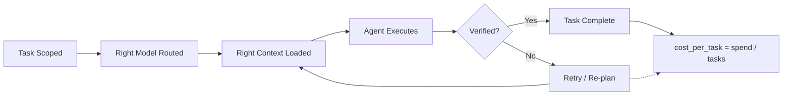
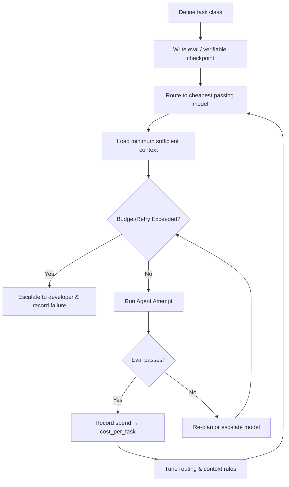

> [!SUMMARY]
> **TL;DR:** Cost per token is a vanity metric. It rewards cheap, low-context, high-retry behavior that destroys actual productivity. The north star for AI engineering is **cost per completed task**: dollars divided by units of shipped, verified work. The levers that move it (model routing, context engineering, skill scoping, termination conditions, eval-driven development) are not the levers that move your token bill, and conflating the two is how teams accidentally ship slower while their dashboards look better.


## Why Cost Per Token Is a Vanity Metric

Token cost is seductive because it is trivially measurable. Every provider hands you a meter. You can build a dashboard in an afternoon. You can slice it by model, by team, by hour. It feels like rigor.

But a metric is only useful if the behavior it rewards is the behavior you want. Cost per token rewards:

- **Cheaper models, always.** A model that costs 1/10th as much and needs 10x the retries to ship the same change is a wash on cost and a loss on time. The dashboard shows a win; the calendar shows a loss.
- **Smaller context, always.** Trimming the context window cuts tokens by definition. But an agent that lacks the context to resolve a task on the first try will retry, re-explore, and ultimately consume *more* tokens finishing the same job, just spread across more calls that each look cheap.
- **Fewer prompts, always.** If you reward "low prompt count," developers stop delegating. They go back to hand-writing boilerplate the agent could have generated for pennies. The token bill shrinks; the payroll bill, the one you actually feel, grows.

The shape of the problem is simple. **Tokens are an input. Tasks are an output.** Optimizing inputs without measuring outputs is how you build a factory that uses less steel and ships fewer cars.

> [!IMPORTANT]
> **The metric inversion:** A team whose token bill is rising but whose cost per completed task is falling is winning. A team whose token bill is falling but whose cost per completed task is rising is dying, and they just do not know it yet.


## Defining Cost Per Task

Before you can optimize it, you have to define it. "Task" is a slippery word, and most teams fail at this step by leaving it vague.

A **task** is a unit of work that has a verifiable outcome. Not a prompt. Not a turn. Not an "agent session." A task is:

- **Bounded**: it has a clear start and a clear definition of done.
- **Verifiable**: completion can be checked by a test, a build, a review, or an observable behavior.
- **Atomic enough to attribute cost**: you can reasonably associate the tokens spent with the outcome.

"Fix the failing test in `auth.spec.ts`" is a task. "Make the codebase better" is not. "Add a `/health` endpoint that returns 200" is a task. "Refactor for performance" is not, unless you define "performance" as a measurable threshold and treat hitting it as done.

Once you have a definition, the metric is mechanical:

```
cost_per_task = total_llm_spend / completed_verified_tasks
```

The denominator is what separates this from every token dashboard you have already built. A token dashboard tells you *what you spent*. Cost per task tells you *what you got for it*.

| Metric | What it measures | What it rewards | Good for |
|--------|------------------|-----------------|----------|
| Cost per token | Input efficiency | Cheap models, tiny context | Procurement |
| Cost per prompt | Call frugality | Not delegating, hand-editing | Nothing useful |
| Cost per task | Output efficiency | Scoping, routing, context, verification | Engineering |
| Tasks per developer-hour | Throughput | Delegating well | Capacity planning |

Cost per task is the only row in that table an engineering team should be optimizing directly. The others are downstream of it, and only worth tracking as diagnostics when cost per task moves the wrong way.


## The Levers That Actually Move It

This is where most teams get confused, because the levers that reduce cost per task are *not* the levers that reduce cost per token. In many cases, they are the exact opposite.



### 1. Model Routing: The Highest-Leverage Lever

The single biggest cost-per-task win available to most teams is routing tasks to the cheapest model that can reliably complete them. Not the cheapest model overall; it is the cheapest model *that still passes the eval for that task class*.

Deploying a frontier model for a simple one-line rename is pure waste. A cheap model on a multi-file refactor that it will fail and retry four times is *worse* waste, because the retries cost tokens *and* developer attention *and* calendar time. The goal is the saddle point: the model tier where expected retries × cost per attempt is minimized for a given task type.

This is why model-agnostic IDEs and routers matter. They let you express routing rules ("boilerplate edits to the local model, long-horizon refactors to the frontier model, debugging loops to the mid-tier") instead of pinning every task to whichever model the team standardized on.

> [!TIP]
> **Routing rule of thumb:** Start every task class on the cheapest model that completes it *at all* in your evals. Promote to a stronger model only when retry rate or review-reopen rate crosses a threshold. Never promote preemptively "to be safe". Safety is what evals are for.

### 2. Context Engineering: The Lever That Looks Like It Raises Cost

Here is the counterintuitive part. Loading more, better-structured context into a prompt *raises* your token bill and *lowers* your cost per task, as long as that context prevents retries.

An agent that receives a precise schema, the relevant test file, and a `SKILL.md` describing the exact workflow will often complete a task in a single pass with a large but bounded context. An agent that receives a vague instruction and no context will "explore", reading dozens of files, guessing at conventions, and producing output that fails review. The first agent spends more tokens per call but fewer calls per task. The second agent spends less per call and more per task, *and* produces rework.

This dynamic becomes even more pronounced when you factor in **prompt caching**. With modern LLM APIs, static context (like schemas, codebase guidelines, or large test files) can be cached. If the agent needs a second turn or a slight correction, it doesn't pay for that massive context all over again; it only pays a fraction of the cost for cache hits. Caching turns context from a recurring tax into a one-time setup fee, making rich context an even more dominant strategy.

This is why teams that optimize purely for token reduction keep getting worse outcomes. They cut the context that was preventing retries. The token line goes down; the cost-per-task line goes up.

I covered the mechanics of this in [Context Engineering for AI Agents](/post/context-engineering-for-ai-agents). The short version is that context is not a cost to minimize, it is a multiplier on first-pass success rate.

### 3. Skill Scoping: Defining the Task Boundary

Cost per task has a denominator problem if you let agents define their own tasks. "Refactor the auth module" is one task that can absorb a day of retries, or it is five scoped sub-tasks each of which ships in one pass. The cost per task looks identical on a naive metric, but the second version actually produced verified work.

The discipline here is the same one I describe in [The SKILL.md Playbook](/post/the-skill-md-guide): scope tasks to something with a verifiable checkpoint, and stop the agent when it hits that checkpoint. Unscoped tasks let agents run in correction loops, the single most expensive failure mode in agentic engineering, because each retry is a fresh full-context call and the agent often never converges.

> [!WARNING]
> **The retry furnace:** A stuck agent in an unbounded correction loop can burn an entire daily budget on a single task and produce zero shippable output. On a cost-per-token dashboard this looks like "one expensive call." On a cost-per-task dashboard it shows up as `∞`, which is the honest answer: the task never completed. That `∞` is the signal you were missing.

### 4. Termination Conditions: Killing the Retry Furnace

Every agentic workflow needs explicit termination conditions: a max retry count, a max token budget per task, a max wall-clock time, and a human-checkpoint on repeated failure. These are not pessimism. They are how you keep the denominator of cost per task honest.

Without termination conditions, a single stuck task can silently absorb the budget that would have shipped a dozen other tasks. The token dashboard shows spending. The cost-per-task dashboard shows a task that cost $40 and produced nothing, and that is the number that should trigger a routing or context change.

### 5. Eval-Driven Development: The Missing Half of the Metric

You cannot compute cost per task without a way to verify task completion, and you cannot verify task completion without evals. This is why cost-per-token caught on first: it requires no evals. You just read the meter. Cost per task requires you to define what "done" means and check for it, which is real work, but it is the work that makes every other lever tunable.

If you cannot write an eval for a task class, you do not actually know what that task is, which means you cannot route it, scope it, or budget it. The eval *is* the task definition. Start there.




## A Worked Example

Two developers on the same team, same codebase, same task class: "add a new CRUD endpoint to the orders service, with tests."

| | Developer A | Developer B |
|---|---|---|
| Model | Frontier, every call | Routed: local for boilerplate, mid-tier for logic |
| Context | None; agent explores | Schema + test template + skill file |
| Retries | 4 (broke tests twice, misread convention) | 1 |
| Tokens used | 180k | 95k |
| Token cost | $2.70 | $1.20 |
| Tasks completed (verified) | 1 | 1 |
| **Cost per task (LLM only)** | **$2.70** | **$1.20** |
| Developer time invested | 25 min review + fixes | 8 min review |
| **Fully Loaded Cost per Task** | **$52.70** | **$17.20** |

*(Note: Fully Loaded Cost per Task calculated as: `LLM Spend + (Developer Time × $120/hr)`)*

On a token dashboard, Developer A looks fine: $2.70 is cheap. On a cost-per-task dashboard, B is 2.2× more efficient on LLM spend alone.

But when you compute the **Fully Loaded Cost per Task (FLCPT)**, the reality is stark. Developer B saved the company $35.50 *on a single task* by freeing up 17 minutes of developer time. The token gap understates the real gap, because developer time is the expense that actually dwarfs your LLM bill.

Now imagine the same comparison but where A used a cheaper model with no context and retried 8 times. Token cost: maybe $1.50, *lower* than B. Cost per task: still $1.50, but the task took an hour of debugging and rework. The token dashboard declares A the winner. The FLCPT dashboard declares A a massive loss. **That gap is the entire point of the metric.**


## How to Roll It Out

If you are leading an engineering team, the shift is concrete:

1. **Pick three task classes to instrument first.** Not "all agent usage." Pick repeatable, verifiable classes ("fix a failing test", "add a CRUD endpoint", "write a migration"). Define done for each.
2. **Tag spend by task, not by prompt.** Most agent tooling now lets you attach metadata to a session. Use it. If yours does not, wrap your agent calls in a thin script that opens a task record, runs the agent, checks the eval, and closes the record with spend attached.
3. **Compute the metric weekly.** Do not build a real-time dashboard; the noise will mislead you. Weekly cost per task, per class, is enough signal to act on.
4. **Tune one lever at a time.** Change routing for one task class. Watch cost per task for two weeks. Then change context. Then change scoping. The point is to learn which lever moves which class; they are not interchangeable.
5. **Reward developers who lower cost per task, not those who lower token spend.** This is the cultural lever, and it is the one that matters most. Whatever you celebrate becomes the metric people optimize for. If you celebrate a falling token bill, you will get a falling token bill and a slowing roadmap. If you celebrate a falling cost per completed task, you will get cheaper, faster shipping, and the token bill will take care of itself as a side effect.

> [!IMPORTANT]
> **The cultural shift:** Stop asking "how do we reduce our AI bill?" Start asking "how do we ship more verified work per dollar?" The first question optimizes inputs and punishes delegation. The second optimizes outputs and rewards engineering judgment. They sound similar. They produce opposite organizations.


## The North Star

Cost per token told you what you spent. Cost per task tells you what you built. The first is an invoice. The second is an engineering metric. Conflating them is the original sin of the AI adoption cycle, and it is the one that keeps teams confused about why their dashboards improve while their velocity does not.

Optimize the denominator. Define tasks, write evals, route models, engineer context, scope skills, set termination conditions. The token bill will move however it moves. The number that matters, dollars per unit of shipped, verified work, will move down. That is the whole game.

## Related Reading

For the context lever in depth, read [Context Engineering for AI Agents](/post/context-engineering-for-ai-agents). For the skill-scoping lever, read [The SKILL.md Playbook](/post/the-skill-md-guide). For the enterprise-scale version of this argument (why uncapped token budgets destroy ROI), read [The Invoice Shock](/post/enterprise-ai-adoption-roadmap). For why most teams should start with skills before building cost instrumentation platforms, read [Why Most Orgs Don't Need Specialized Agentic Tools](/post/why-most-orgs-dont-need-specialized-agentic-tools).
